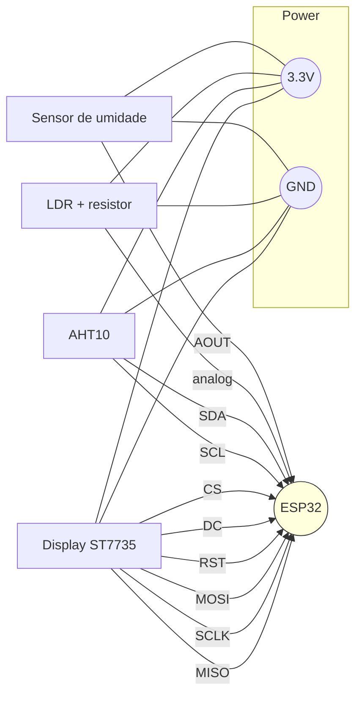

# Hardware Connections

Este documento descreve como conectar os sensores e o display ao ESP32 conforme utilizado no firmware `ESP32SmartPlantPot.ino`.

## Sensor de umidade de solo capacitivo
- **VCC** -> 3.3&nbsp;V
- **GND** -> GND
- **AOUT** -> GPIO 34 (leitura analógica)

## Sensor de luminosidade (LDR + resistor)
- LDR ligado a 3.3&nbsp;V
- Resistor (~10kΩ) para GND
- Ponto comum (entre LDR e resistor) -> GPIO 35 (leitura analógica)

## Sensor AHT10 (temperatura e umidade)
- **VCC** -> 3.3&nbsp;V
- **GND** -> GND
- **SDA** -> GPIO 21 (I2C)
- **SCL** -> GPIO 22 (I2C)

## Display ST7735 1.8"
- **VCC** -> 3.3&nbsp;V
- **GND** -> GND
- **CS** -> GPIO 5
- **DC** -> GPIO 16
- **RST** -> GPIO 17
- **MOSI** -> GPIO 23 (SPI)
- **SCLK** -> GPIO 18 (SPI)
- **MISO** -> GPIO 19 (opcional)

> **Nota:** os pinos MOSI, SCLK e, quando necessário, MISO utilizam o barramento SPI padrão do ESP32.

## Diagrama de ligações

